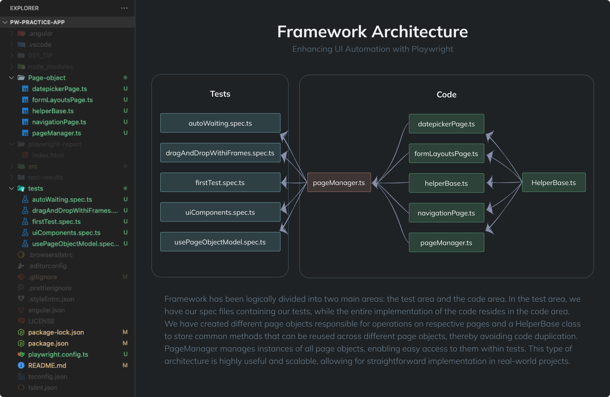

### Test Framework for Ngx-Admin Angular 14 Application
This test framework was created for the Ngx-Admin Angular 14 application. The application was developed by akveo.com. This is modified and more lightweight version of original application to practice UI Automation with Playwright. 

The original repo is here: https://github.com/akveo/ngx-admin
___
### Introduction to Test Framework

This framework automates and validates the UI of the Ngx-Admin application using Playwright. Built on the Page Object Model (POM) pattern, it enhances maintainability and scalability. The architecture is modular, divided into **Tests** and **Code** areas, making code management and testing easier. The `HelperBase` class avoids code duplication, increasing efficiency. The `PageManager` class centrally manages instances of all Page Objects. Below is a detailed description of the framework's architecture and its components.

These tests were developed based on the training provided by Test Automation Engineer <a href="https://github.com/bondar-artem">Artem Bondar</a>

___
### Framework Architecture

Test framework has been carefully designed to ensure modularity and ease of code maintenance. Below is a detailed description of our project's architecture.




#### Separation of Logic
Architecture is divided into two main areas: **Tests** and **Code**.

#### Tests Area
The tests area contains files with tests that use the Page Object Model (POM) to interact with the application pages. These test files use instances managed by the **PageManager** to interact with the application pages.

#### Code Area

The code area contains classes representing individual pages of the application and helper classes. Where the **PageManager** centrally manages instances of all Page Objects. t allows easy access to different pages of the application through centralized instance management. The code area also contains **HelperBase**: A base helper class that contains frequently used methods. This avoids code duplication.

___
### Dependencies

- Playwright v1.43.1
- Node v18.20.2
- npm v9.6.5
- VSCode 1.88.1 (Universal)
- Applitools v1.17.0
- Faker v8.4.1
- Allure-playwright v3.0.0-beta.3


___
### Installation Guidelines
Download the code. The easiest way to do that is to clone GitHub repository:
  ```sh
  git clone https://github.com/rkolcz/pw-practice-app
  ```
After clone is completed, you need to install npm modules:
  ```sh
  cd ngx-admin && npm i
  ```
Run local copy in development mode by execute:
  ```sh
  npm start
  ```
In your browser, go to:
  ```sh
  http://localhost:4200
  ```
To run tests, make sure you have installed Playwright.
```
npm init playwright@latest
```
or if needed
```
npm init playwright@latest --force
```

___
### Run tests Guidelines
###### Run all test in order
- Browser: all
- GUI: no
```
npx playwright test
```
###### Run all test at once
- Browser: all
- GUI: yes
```
npx playwright test --headed 
```
###### Run test in UI mode
```
npx playwright test --ui
```
___

IMPORTANT: to run the tests from `main`, you'll need to setup your [.env](.env) following the [.env.example](.env.example), otherwise many tests will fail